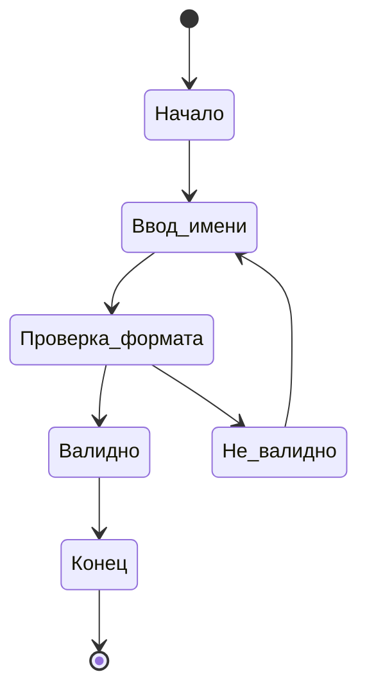
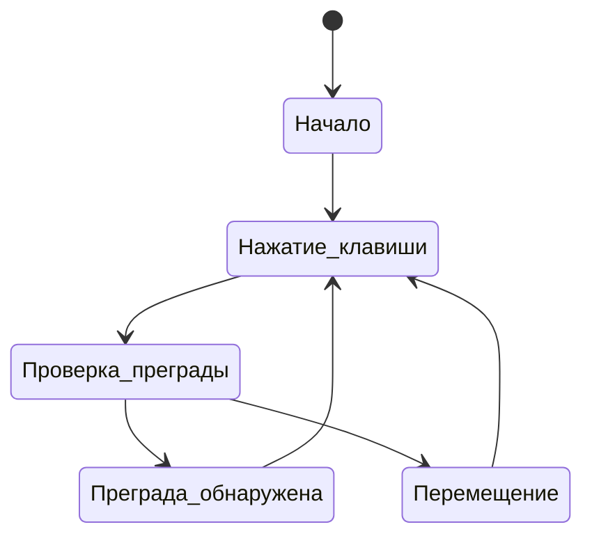
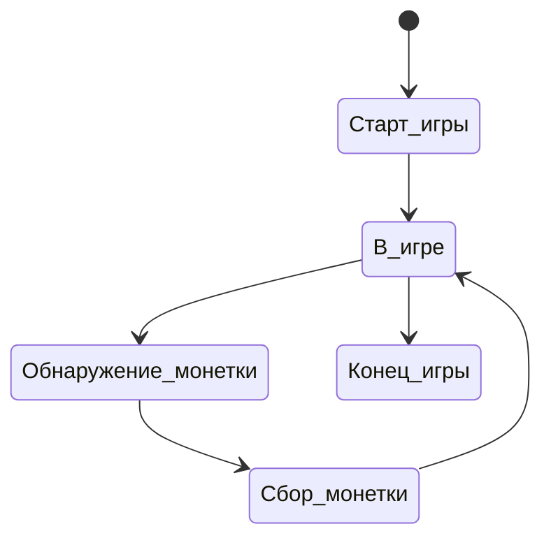
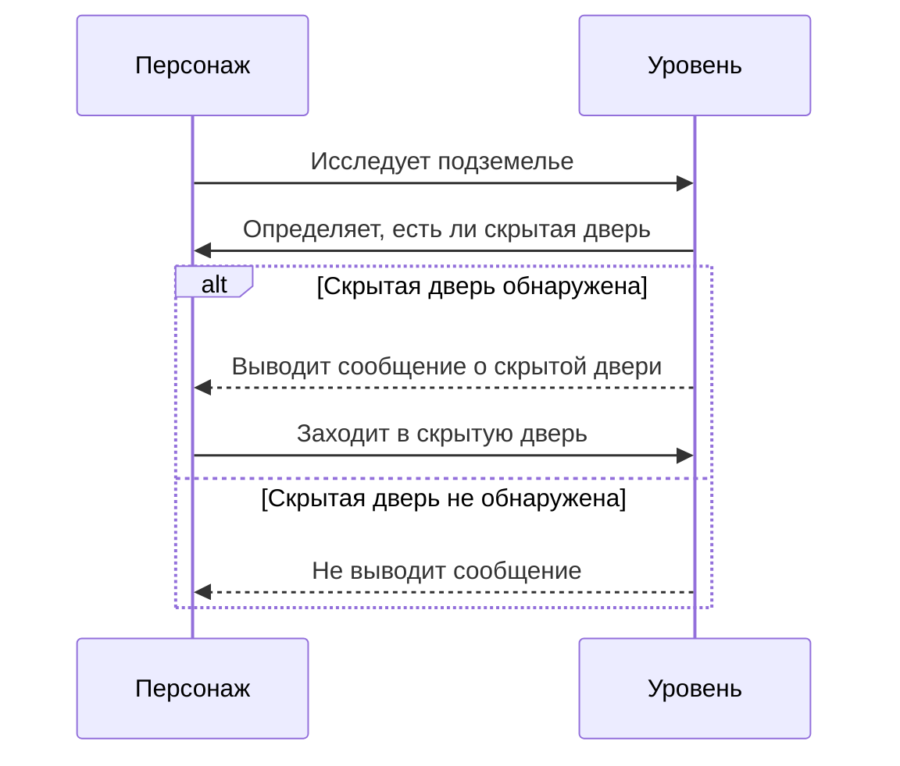

# Поведенческие модели ПО
-------
Диаграмма состояний
1. Состояния создания нового персонажа:

2. Состояния перемещения по подземелью:

3. Состояния игрового процесса:

Диаграмма последовательности

Обнаружение скрытой двери:

