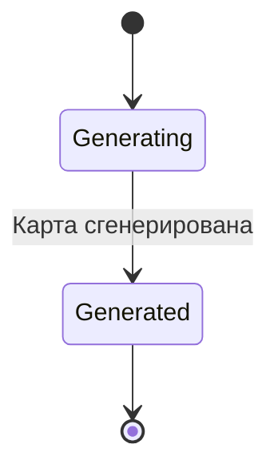
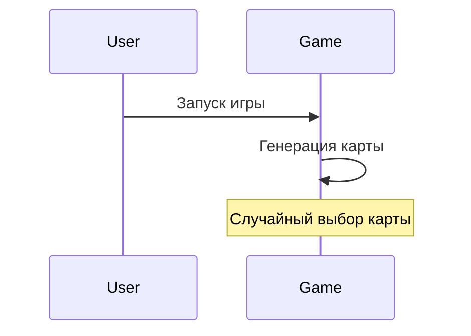
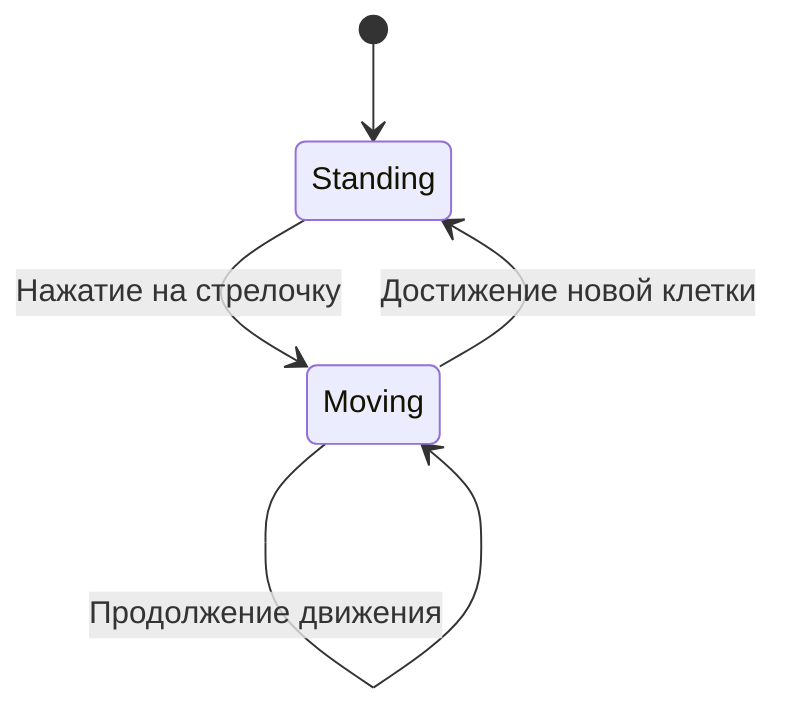
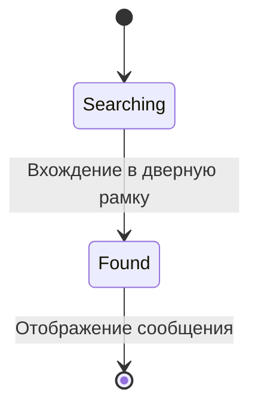

# Поведенческие модели ПО
-------
## Алгоритм "Смена карты"

**Диаграмма состояний**:

**Диаграмма последовательности**:

-------
## Алгоритм "Смена карты"

**Диаграмма состояний**

-------
## Алгоритм "Нахождение скрытой комнаты":

**Диаграмма состояний**

