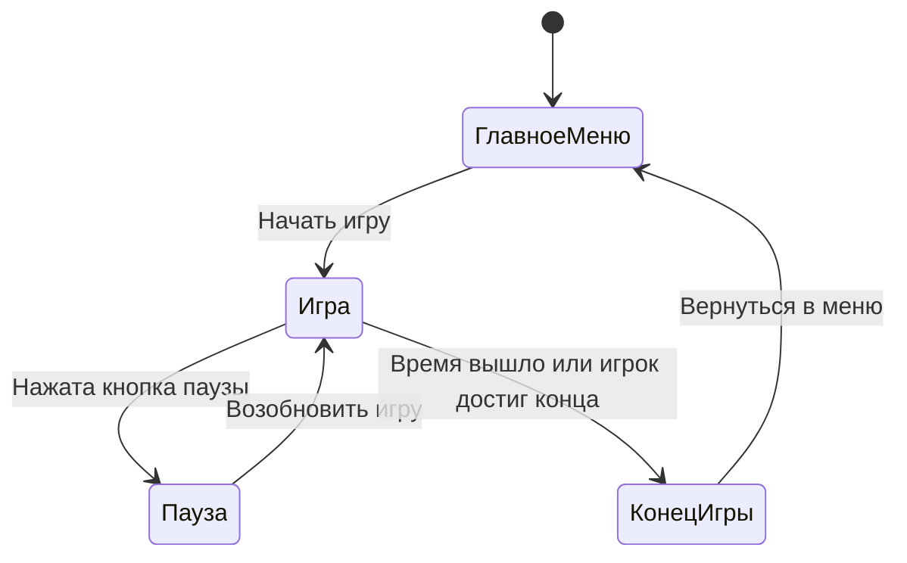
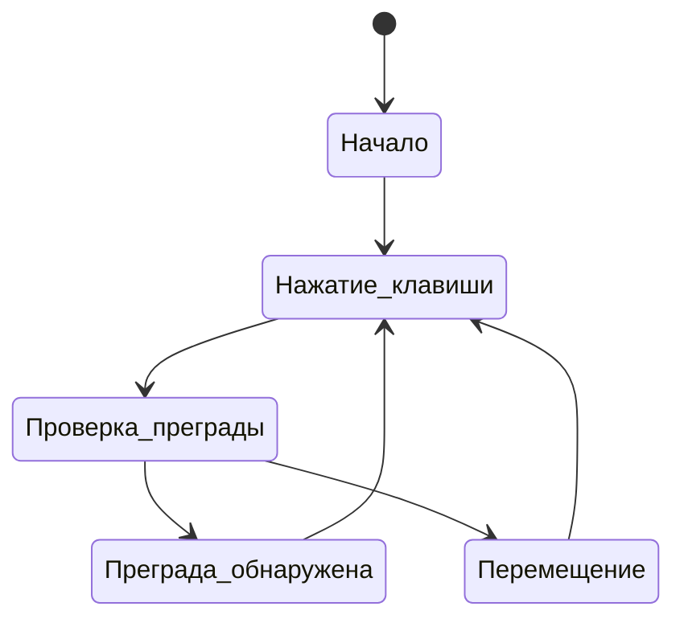
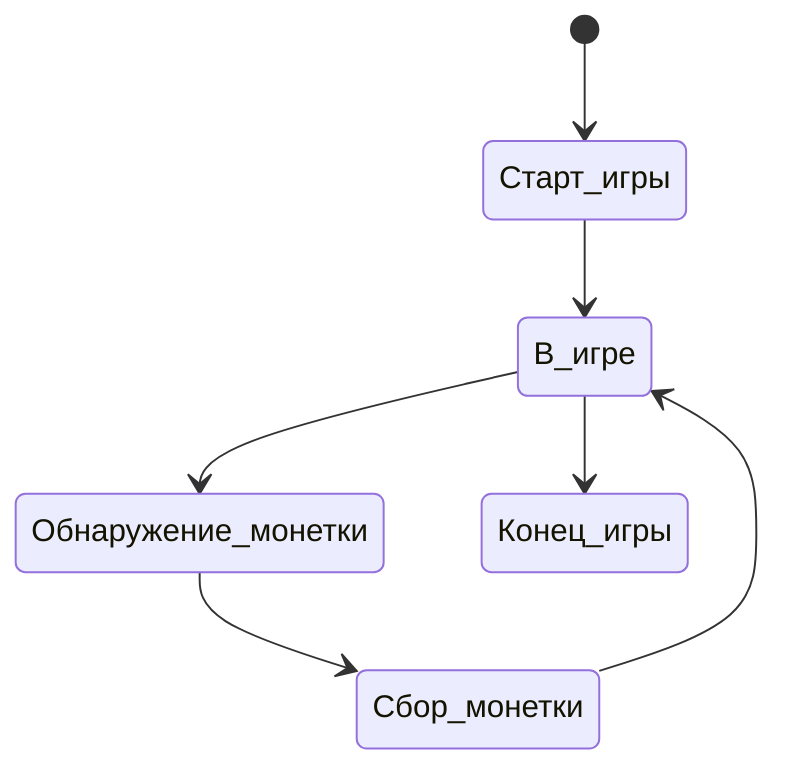
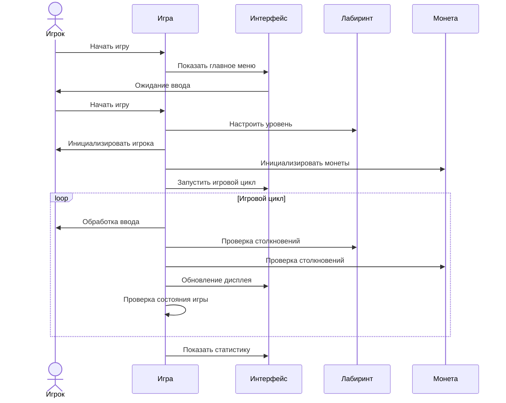

# Поведенческие модели ПО
-------

## Диаграмма состояний игры

Описание:

1. **Начальное состояние**:
   - Игра начинается с состояния "ГлавноеМеню".

2. **ГлавноеМеню**:
   - Игра находится в главном меню, ожидая, когда игрок выберет начать игру.
   - Переход: Когда игрок выбирает "Начать игру", игра переходит в состояние "Игра".

3. **Игра**:
   - Основное состояние, в котором происходит игровой процесс.
   - Переход: Если игрок нажимает кнопку паузы, игра переходит в состояние "Пауза".
   - Переход: Если время игры истекает или игрок достигает конца уровня, игра переходит в состояние "КонецИгры".

4. **Пауза**:
   - В этом состоянии игра приостановлена.
   - Переход: Когда игрок выбирает продолжить игру, игра возвращается в состояние "Игра".

5. **КонецИгры**:
   - Это состояние означает завершение игры, когда время вышло или игрок достиг конца уровня.
   - Переход: Игрок может вернуться в главное меню, и игра переходит в состояние "ГлавноеМеню".

Примечания:
- **Начальное состояние** (обозначено как [*]) указывает, что игра начинается с главного меню.
- Переходы между состояниями указываются стрелками с описанием действия, которое вызывает переход.

---

## Диаграмма состояний 

1. **Начало**: Начальное состояние.
2. **Нажатие_клавиши**: Пользователь нажимает клавиши для перемещения.
3. **Проверка_преграды**: Проверка наличия преграды перед движением.
4. **Преграда_обнаружена**: Если преграда обнаружена на пути.
5. **Перемещение**: Перемещение в случае отсутствия преграды.

---

## Диаграмма состояний: Игровой процесс

Описание:

1. **Старт_игры**: Начало игры.
2. **В_игре**: Игрок находится в процессе игры.
3. **Обнаружение_монетки**: Обнаружение монетки на игровом уровне.
4. **Сбор_монетки**: Сбор монетки игроком.
5. **Конец_игры**: Завершение игры.

---

## Диаграмма последовательности игрового цикла

Описание:

Диаграмма последовательности показывает взаимодействие частей игры. В ней участвуют:

- **Игрок**: человек, который играет.
- **Игра**: основная логика игры.
- **Интерфейс**: экран, показывающий меню и игру.
- **Лабиринт**: сетка стен и проходов.
- **Монета**: объекты для сбора.

Процесс начинается с запуска игры (Игрок -> Игра). Игра отображает главное меню (Игра -> Интерфейс), и Интерфейс ждет выбора игрока (Интерфейс -> Игрок). Игрок выбирает начать игру (Игрок -> Игра).

Игра настраивает лабиринт (Игра -> Лабиринт), инициализирует игрока (Игра -> Игрок) и размещает монеты (Игра -> Монета). Затем начинается игровой цикл (Игра -> Интерфейс).

В игровом цикле:
- Игра обрабатывает действия игрока (Игра -> Игрок).
- Проверяет столкновения с лабиринтом (Игра -> Лабиринт) и монетами (Игра -> Монета).
- Обновляет экран (Игра -> Интерфейс).
- Проверяет состояние игры (Игра -> Игра).

Когда игра заканчивается, Игра показывает результаты (Игра -> Интерфейс).

Эта диаграмма иллюстрирует работу игры от запуска до завершения.