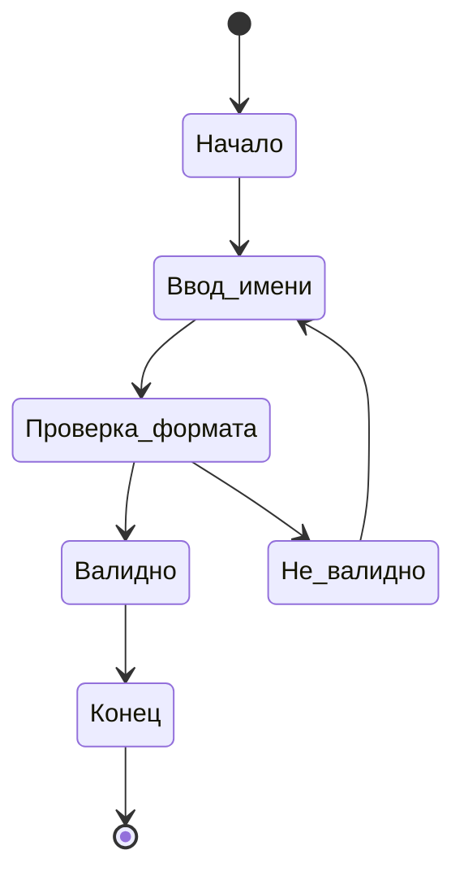
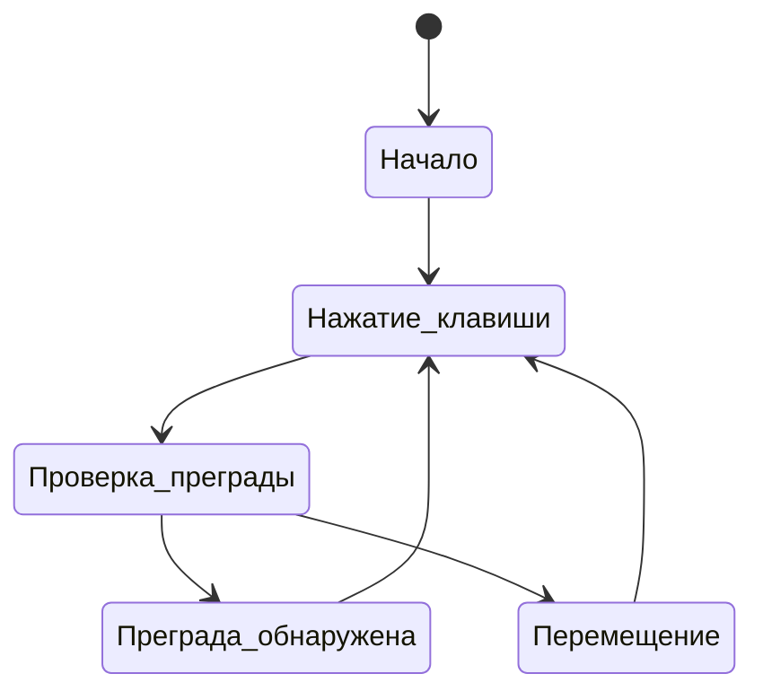
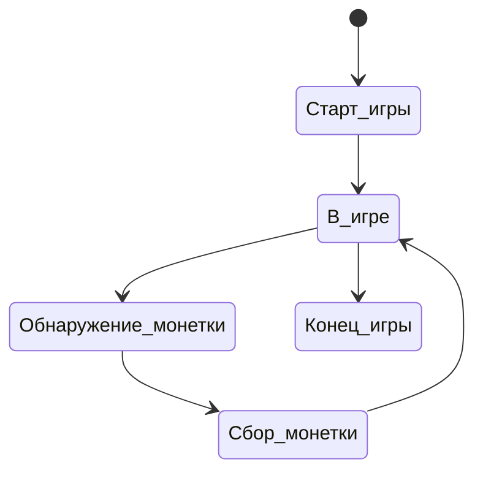
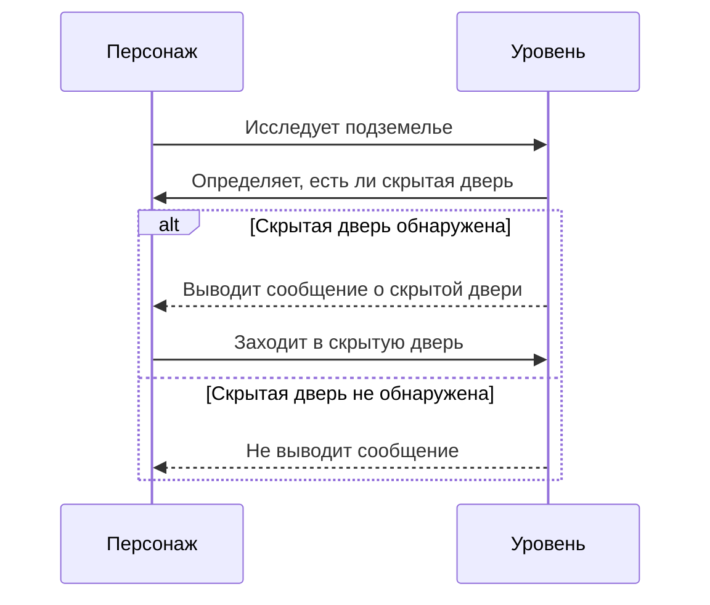

# Поведенческие модели ПО
-------

## Диаграмма состояний: Создание нового персонажа

1. **Начало**: Начальное состояние.
2. **Ввод_имени**: Пользователь вводит имя персонажа.
3. **Проверка_формата**: Проверка корректности формата введенного имени.
4. **Валидно**: Если имя введено в правильном формате.
5. **Не_валидно**: Если имя введено в неправильном формате.
6. **Конец**: Завершение процесса создания нового персонажа.

## Диаграмма состояний: Перемещение по подземелью

1. **Начало**: Начальное состояние.
2. **Нажатие_клавиши**: Пользователь нажимает клавиши для перемещения.
3. **Проверка_преграды**: Проверка наличия преграды перед движением.
4. **Преграда_обнаружена**: Если преграда обнаружена на пути.
5. **Перемещение**: Перемещение в случае отсутствия преграды.

## Диаграмма состояний: Игровой процесс

1. **Старт_игры**: Начало игры.
2. **В_игре**: Игрок находится в процессе игры.
3. **Обнаружение_монетки**: Обнаружение монетки на игровом уровне.
4. **Сбор_монетки**: Сбор монетки игроком.
5. **Конец_игры**: Завершение игры.

## Диаграмма последовательности: Обнаружение скрытой двери

Описание:

Персонаж исследует подземелье. Уровень игры проверяет, есть ли скрытая дверь. Если скрытая дверь обнаружена, уровень выводит сообщение о ее наличии, и персонаж заходит в скрытую дверь. В случае, если скрытая дверь не обнаружена, уровень не выводит сообщение.