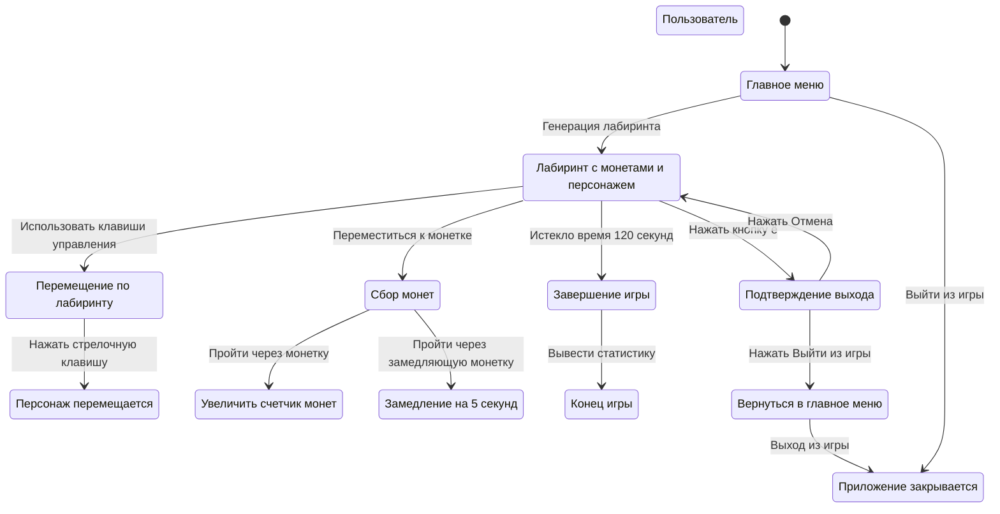
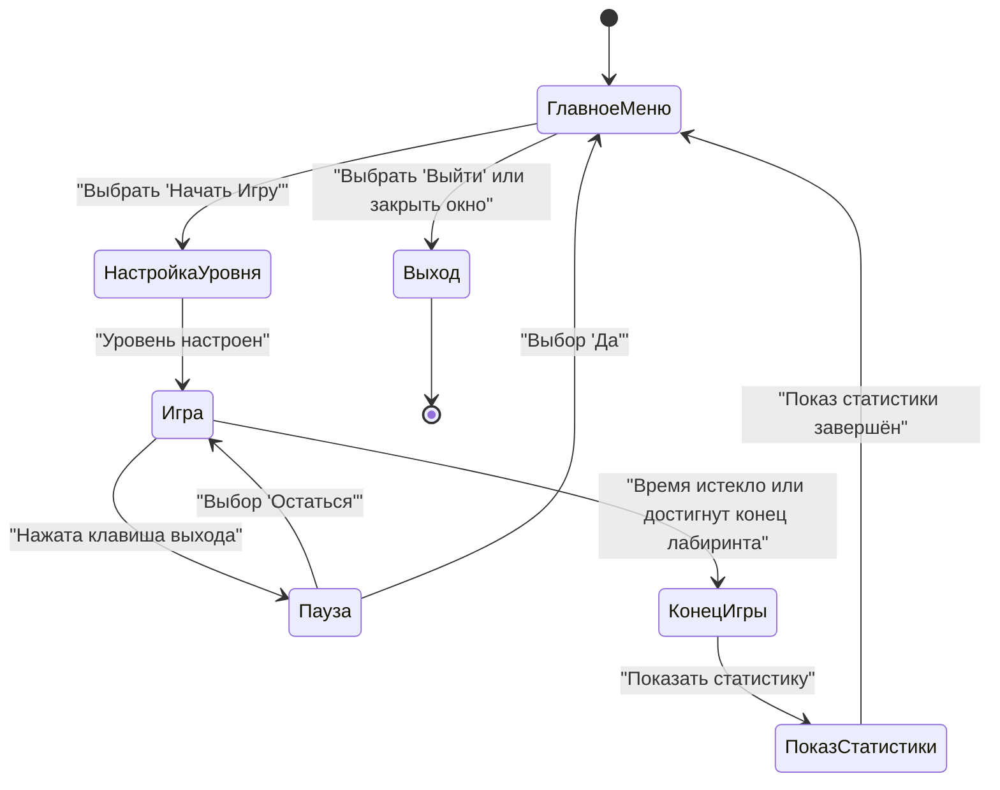
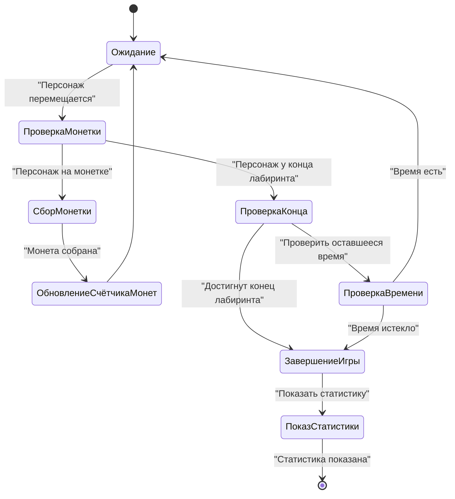
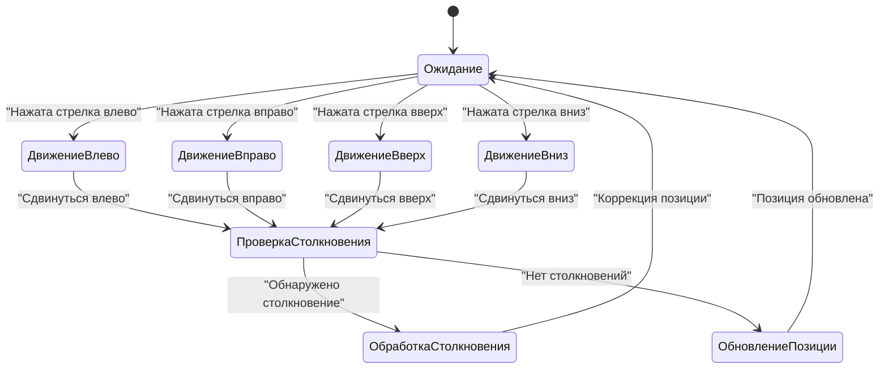

# Функциональные модели
-----------------------------------------------------

## Описание сценария использования в формате пинг-понга 

### Создание нового персонажа

1. **Пользователь запускает игру:**
   - Пользователь выбирает опцию "Запустить игру", если хочет начать игру.
   - Генерируется лабиринт с монетами и персонажем

2. **Пользователь выходит из игры**
   - Пользователь выбирает "Выйти из игры", если он передумал начинать игру
   - Приложение закрывается

### Перемещение по лабиринту

1. **Пользователь использует клавиши управления:**
   - Пользователь нажимает стрелочные клавиши для перемещения по лабиринту.
   - Приложение обрабатывает ввод пользователя и перемещает персонажа соответственно.

### Сбор монеток

1. **Пользователь подходит к монетке:**
   - Пользователь перемещает персонажа к монетке.
 
2. **Пользователь подбирает монетку:**
   - Пользователь проходит через монетку.
   - Приложение увеличивает количество монеток у персонажа и счетчик монет увеличивается.

3. **Персонаж подбирает монетку-замедляку"**
   - Проходит через монетку
   - Накладывается эффект замедления на 5 секунд 

### Завершение игры
 
1. **Проигрыш из-за временного ограничения:**
   - Прошло 120 секунд.
   - Приложение завершает игру и выводит статистику.

2. **Выход из игры:**
   - Пользователь нажимает кнопку "ё" на клавиатуре.
   - Приложение спрашивает подтверждение действий пользователя
   - Пользователь нажимает на Выйти из игры
   - Приложение перекидывает пользователя в главное меню

3. **Остаться в игре**
   - Пользователь нажимает кнопку "ё" на клавиатуре.
   - Приложение спрашивает подтверждение действий пользователя
   - Пользователь нажимает на "Отмена"
   - Игра продолжается
	
---------------------------------------------------------------------
## Диаграмма вариантов использования приложения

---------------------------------------------------------------------
## Диаграммы активности

### Основной циклс игры

### Сбор монет и завершение игры

### Движение игрока

