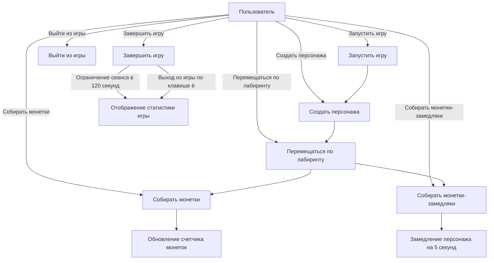
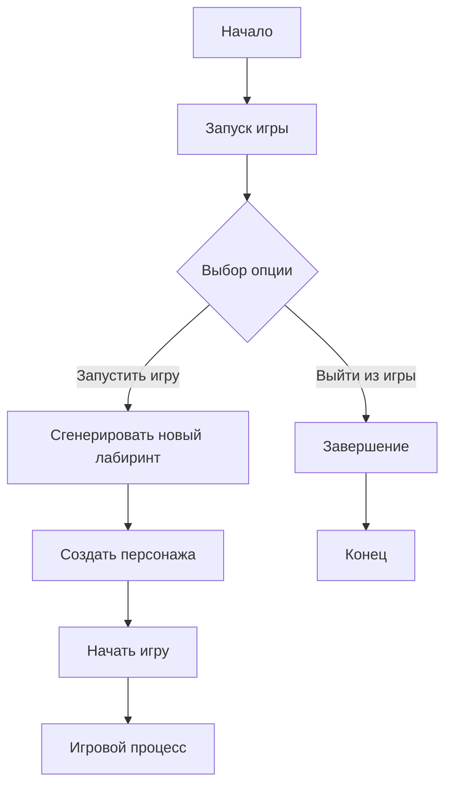
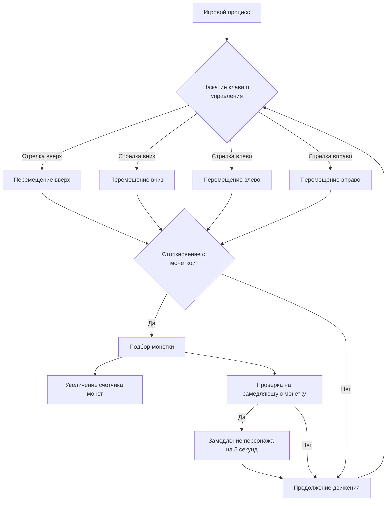
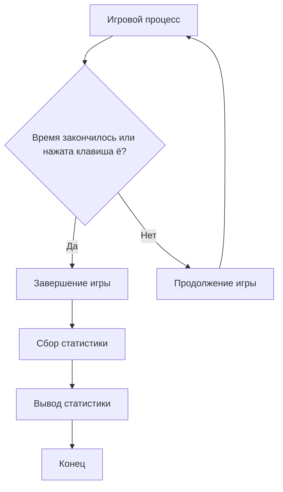
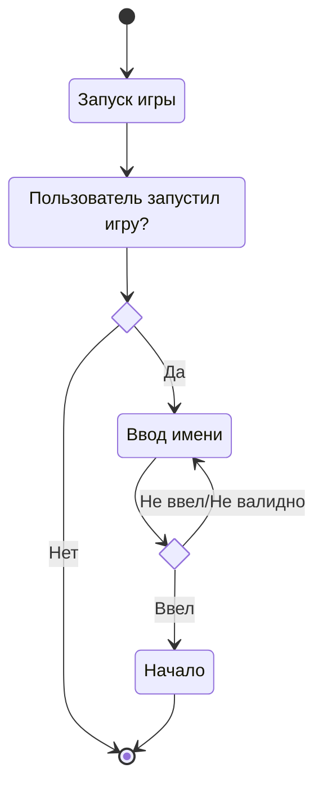
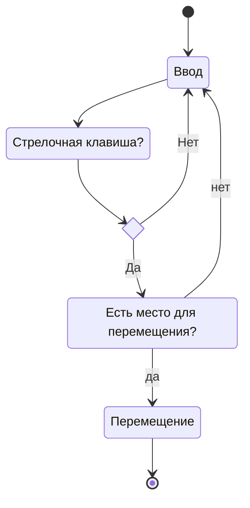
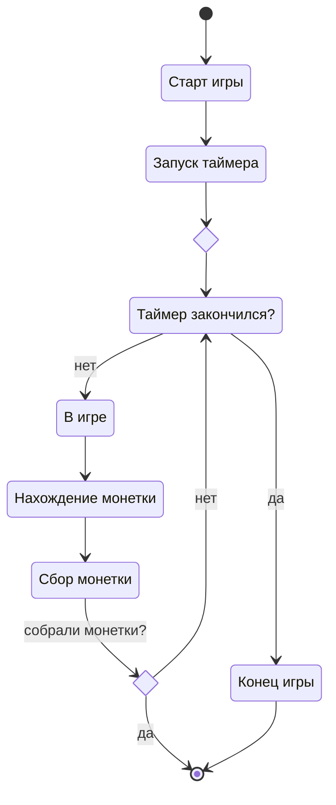
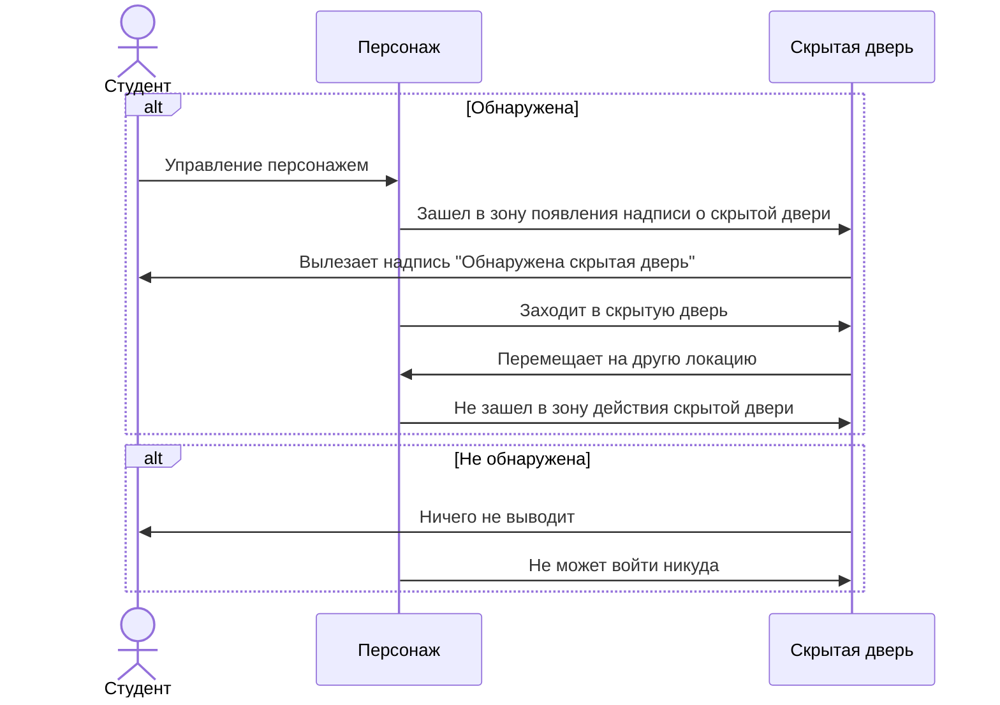

# Функциональные модели
-----------------------------------------------------

## Описание сценария использования в формате пинг-понга 

### Создание нового персонажа

1. **Пользователь запускает игру:**
   - Пользователь выбирает опцию "Запустить игру", если хочет начать игру.
   - Генерируется лабиринт с монетами и персонажем

### Перемещение по лабиринту

1. **Пользователь использует клавиши управления:**
   - Пользователь нажимает стрелочные клавиши для перемещения по лабиринту.
   - Приложение обрабатывает ввод пользователя и перемещает персонажа соответственно.

### Сбор монеток

1. **Пользователь подходит к монетке:**
   - Пользователь перемещает персонажа к монетке.
 
2. **Пользователь подбирает монетку:**
   - Пользователь проходит через монетку.
   - Приложение увеличивает количество монеток у персонажа и счетчик монет увеличивается.

3. **Персонаж подбирает монетку-замедляку"**
   - Проходит через монетку
   - Накладывается эффект замедления на 5 секунд 

### Завершение игры
 
1. **Проигрыш из-за временного ограничения:**
   - Прошло 120 секунд.
   - Приложение завершает игру и выводит статистику.

2. **Выход из игры:**
   - Пользователь нажимает кнопку "ё" на клавиатуре.
   - Приложение завершает игру и выводит статистику.
	
---------------------------------------------------------------------
## Диаграмма вариантов использования приложения

---------------------------------------------------------------------
## Диаграмма активности

### Запуск игры и новый персонаж:

---------------------------------------------------------------------
### Перемещение по подземелью

---------------------------------------------------------------------
### Завершение и вывод статистики

---------------------------------------------------------------------

## Диаграммы алгоритмов

### Диаграммы состояний 

**Создание нового персонажа**

---------------------------------------------------------------------

**Перемещение по подземелью**

---------------------------------------------------------------------

**Gameplay**

---------------------------------------------------------------------

### Диаграмма последовательности

**Обнаружение скрытой двери**

