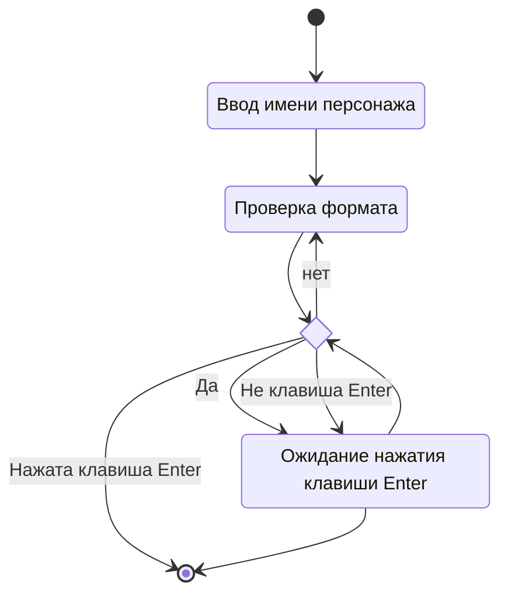
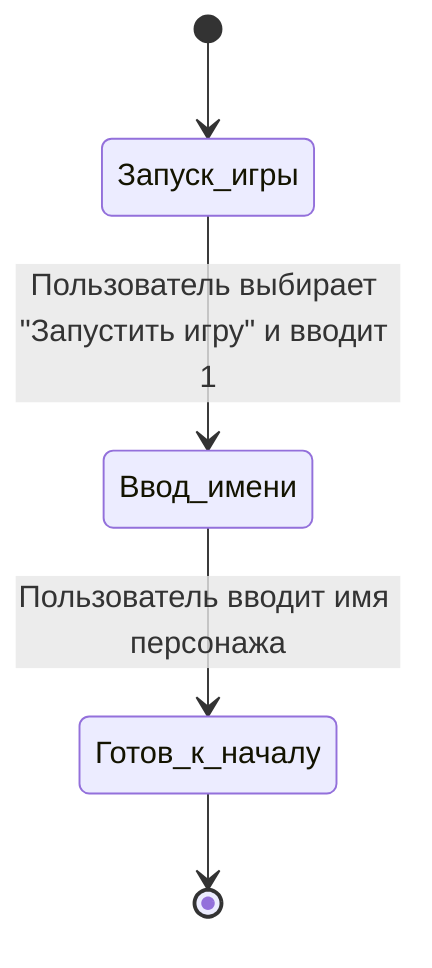
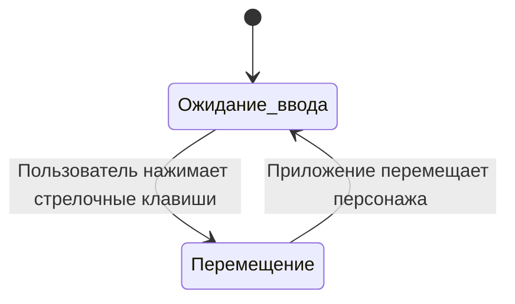
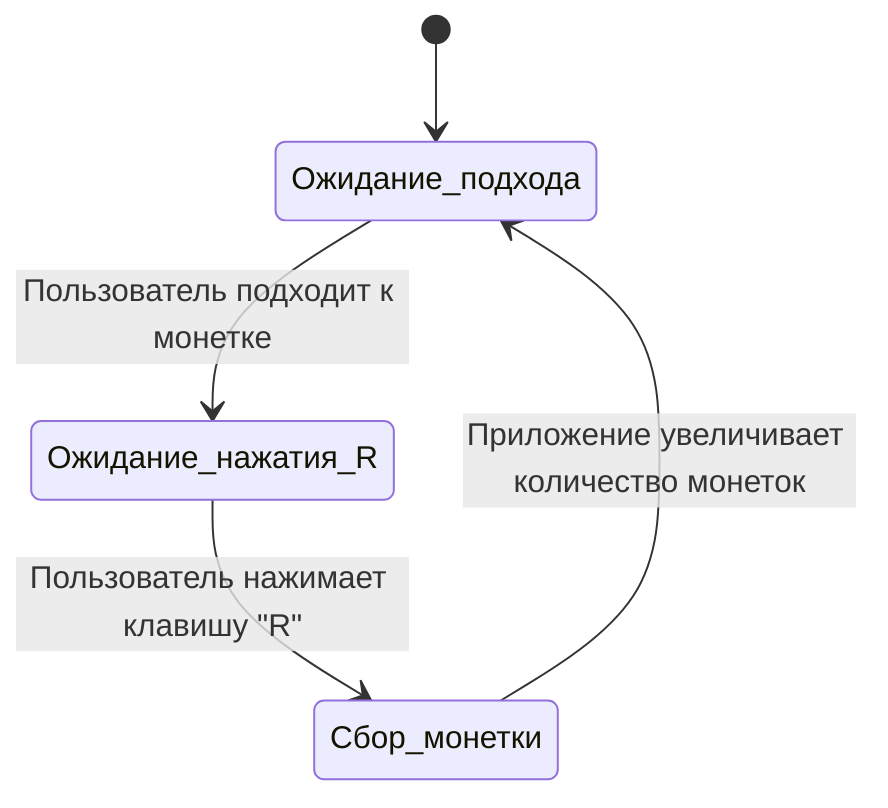
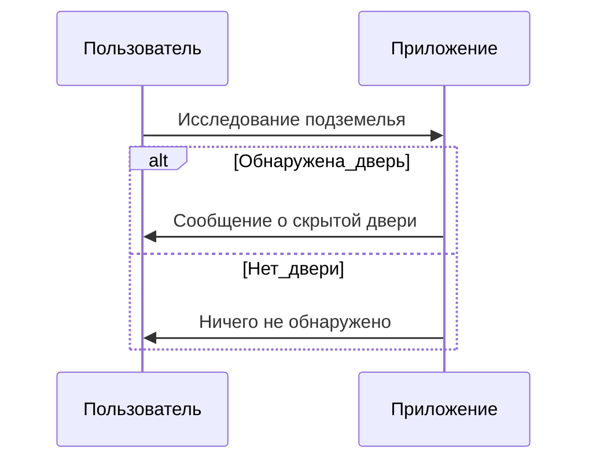

# Функциональные модели
-----------------------------------------------------

## Описание сценария использования в формате пинг-понга 

### Создание нового персонажа

1. **Пользователь запускает игру:**
   - Пользователь выбирает опцию "Запустить игру" и вводит 1, если хочет начать игру.

2. **Пользователь вводит имя персонажа:**
   - Пользователь вводит имя персонажа.
   - Приложение принимает имя персонажа и продолжает выполнение.

### Перемещение по подземелью

1. **Пользователь использует клавиши управления:**
   - Пользователь нажимает стрелочные клавиши для перемещения по подземелью.
   - Приложение обрабатывает ввод пользователя и перемещает персонажа соответственно.

### Сбор монеток

1. **Пользователь подходит к монетке:**
   - Пользователь перемещает персонажа к монетке.
 
2. **Пользователь подбирает монетку:**
   - Пользователь нажимает клавишу "R".
   - Приложение увеличивает количество монеток у персонажа и выводит сообщение об этом.

### Обнаружение секретных комнат

1. **Персонаж обнаруживает скрытую дверь:**
   - Персонаж исследует подземелье.
   - Приложение определяет, что персонаж обнаружил скрытую дверь и выводит сообщение об этом.

### Завершение игры

1. **Достижение финального количества монеток:**
   - Персонаж собирает 20 монеток.
   - Приложение выводит сообщение о завершении игры и статистику.
 
2. **Проигрыш из-за временного ограничения:**
   - Время игры истекло, несмотря на то, что персонаж не собрал 10 монеток.
   - Приложение выводит сообщение о поражении и статистику.

3. **Выход из игры:**
   - Пользователь нажимает кнопку "ё" на клавиатуре.
   - Приложение завершает игру и выводит статистику.
	
---------------------------------------------------------------------
## Диаграмма активности


### Новый персонаж:


* [оффлайн файл](diagrams/new_person.puml)
---------------------------------------------------------------------
### Перемещение по подземелью

```mermaid
graph TD;
    |Начало| [*] --> Move((пользователь нажимает клавишу управления))
    Move -->|Нажата не клавиша управления| [*]
    Move -->|Нажата клавиша управления| CheckWall(Проверка обнаружения стены)
    CheckWall -->|Обнаружена стена| [*]
    CheckWall -->|Стены нет| MoveEnd((Персонаж двигается))
```

* [оффлайн файл](diagrams/Navigating_the_Dungeon.puml)
---------------------------------------------------------------------
### Сбор монеток

```mermaid
graph TD;
    |Начало| [*] --> CheckCoin(Персонаж в зоне действия монетки?)
    CheckCoin -->|Нет| [*]
    CheckCoin -->|Да| CheckKeyPress(Пользователь нажал клавишу R?)
    CheckKeyPress -->|Да| CoinCollected((Монетка подбирается))
    CheckKeyPress -->|Нет| [*]
    CoinCollected --> [*]
```

* [оффлайн файл](diagrams/collecting_coins.puml)
---------------------------------------------------------------------


## Диаграммы алгоритмов

### Диаграммы состояний 

**Создание нового персонажа**



* [оффлайн файл](diagrams/new_person_sostoyanie.puml)
---------------------------------------------------------------------

**Перемещение по подземелью**


* [оффлайн файл](diagrams/Navigating_the_Dungeon_sostoyanie.puml)
---------------------------------------------------------------------

**Сбор монеток**


* [оффлайн файл](diagrams/collecting_coins_sostoyanie.puml)
---------------------------------------------------------------------


### Диаграмма последовательности

**Обнаружение скрытой двери**


* [оффлайн файл](diagrams/hidden_door_subsequence.puml)
