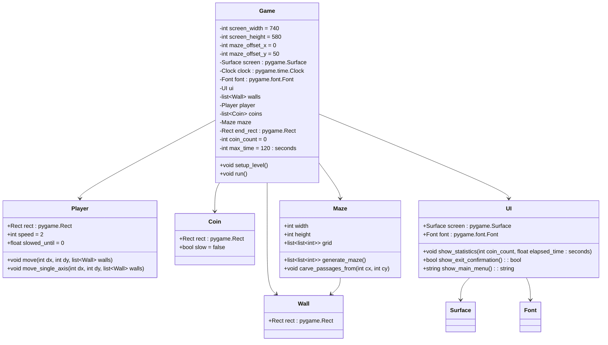

# Структурные модели
----------------------------------------

## Описание внутренней структуры приложения

## Описание классов и методов:

1. **Game**
   - `__init__()`: Создает экземпляры всех необходимых классов (Player, Maze, UI), инициализирует игровой экран, устанавливает начальные параметры игры.
   - `setup_level()`: Вызывает методы Maze для генерации лабиринта, создания стен, монет и установки стартовой и конечной точек. Устанавливает игрока на стартовую позицию.
   - `run()`: Основной игровой цикл, который обрабатывает пользовательский ввод, перемещает игрока, обновляет состояние игры (количество монет, время), проверяет условия победы и поражения, отображает интерфейс и элементы игры на экране. При необходимости вызывает методы UI для показа статистики и подтверждения выхода.

2. **Player**
   - `__init__()`: Создает прямоугольник игрока и задает начальную скорость.
   - `move(dx: int, dy: int, walls: List[Wall])`: Перемещает игрока на заданное расстояние по осям x и y, проверяя столкновения со стенами. Если игрок сталкивается со стеной, его позиция корректируется.
   - `move_single_axis(dx: int, dy: int, walls: List[Wall])`: Обрабатывает перемещение игрока по одной оси, проверяя столкновения со стенами.

3. **Coin**
   - `__init__(pos: Tuple[int, int], slow: bool=False)`: Создает монету на указанной позиции и указывает, замедляет ли она игрока.
   
4. **Wall**
   - `__init__(pos: Tuple[int, int])`: Создает стену на указанной позиции.

5. **Maze**
   - `__init__(width: int, height: int)`: Инициализирует лабиринт с заданными параметрами.
   - `generate_maze() -> List[List[int]]`: Генерирует лабиринт с использованием алгоритма DFS и возвращает его в виде двумерного списка.
   - `carve_passages_from(cx: int, cy: int, maze: List[List[int]])`: Рекурсивно создает проходы в лабиринте, начиная с указанных координат.

6. **UI**
   - `__init__(screen: pygame.Surface, font: pygame.font.Font)`: Инициализирует интерфейс, принимает экран и шрифт для отображения.
   - `show_statistics(coin_count: int, elapsed_time: float)`: Отображает статистику игры (количество собранных монет и прошедшее время) на экране.
   - `show_exit_confirmation() -> bool`: Показывает пользователю окно подтверждения выхода из игры и возвращает результат (выход или продолжение).
   - `show_main_menu() -> str`: Показывает главное меню и возвращает выбор пользователя (например, "start").

### Взаимодействие между классами:

Взаимодействие между классами осуществляется через вызов методов: 
- Game вызывает методы Player для перемещения игрока, Maze для генерации лабиринта, UI для отображения интерфейса.
- Player проверяет столкновения с элементами лабиринта (стены, монеты).
- UI показывает пользователю информацию о текущем состоянии игры и обрабатывает пользовательский ввод для подтверждения выхода или выбора в главном меню.

## Диаграмма объектов

---

Описание диаграммы:

---

### Player

- **rect**: `pygame.Rect` - Позиция и размеры игрока.
- **speed**: `int` = 2 - Скорость движения игрока.
- **slowed_until**: `float` = 0 - Время, до которого игрок замедлен.
- **move(int dx, int dy, list~Wall~ walls)** - Метод для перемещения игрока.
- **move_single_axis(int dx, int dy, list~Wall~ walls)** - Метод для перемещения по одной оси.

### Coin

- **rect**: `pygame.Rect` - Позиция и размеры монеты.
- **slow**: `bool` = false - Флаг, указывающий, замедляет ли эта монета игрока.

### Wall

- **rect**: `pygame.Rect` - Позиция и размеры стены.

### Maze

- **width**: `int` - Ширина лабиринта.
- **height**: `int` - Высота лабиринта.
- **grid**: `list[list[int]]` - Двумерный массив, представляющий структуру лабиринта.
- **generate_maze()**: `list[list[int]]` - Метод для генерации лабиринта.
- **carve_passages_from(int cx, int cy)** - Метод для создания проходов в лабиринте.

### UI

- **screen**: `pygame.Surface` - Экран для отображения интерфейса.
- **font**: `pygame.font.Font` - Шрифт для отображения текста.
- **show_statistics(int coin_count, float elapsed_time: seconds)** - Метод для отображения статистики.
- **show_exit_confirmation()**: `bool` - Метод для подтверждения выхода.
- **show_main_menu()**: `string` - Метод для отображения главного меню.

### Game

- **screen_width**: `int` = 740 - Ширина экрана.
- **screen_height**: `int` = 580 - Высота экрана.
- **maze_offset_x**: `int` = 0 - Горизонтальное смещение лабиринта.
- **maze_offset_y**: `int` = 50 - Вертикальное смещение лабиринта.
- **screen**: `pygame.Surface` - Экран для отображения игры.
- **clock**: `pygame.time.Clock` - Часы для управления временем игры.
- **font**: `pygame.font.Font` - Шрифт для отображения текста.
- **ui**: `UI` - Интерфейс игры.
- **walls**: `list[Wall]` - Список стен лабиринта.
- **player**: `Player` - Игрок.
- **coins**: `list[Coin]` - Список монет в лабиринте.
- **maze**: `Maze` - Лабиринт.
- **end_rect**: `pygame.Rect` - Позиция и размеры конечной точки лабиринта.
- **coin_count**: `int` = 0 - Счетчик собранных монет.
- **max_time**: `int` = 120 (seconds) - Максимальное время игры (в секундах).
- **setup_level()** - Метод для настройки уровня.
- **run()** - Метод для запуска игры.

---