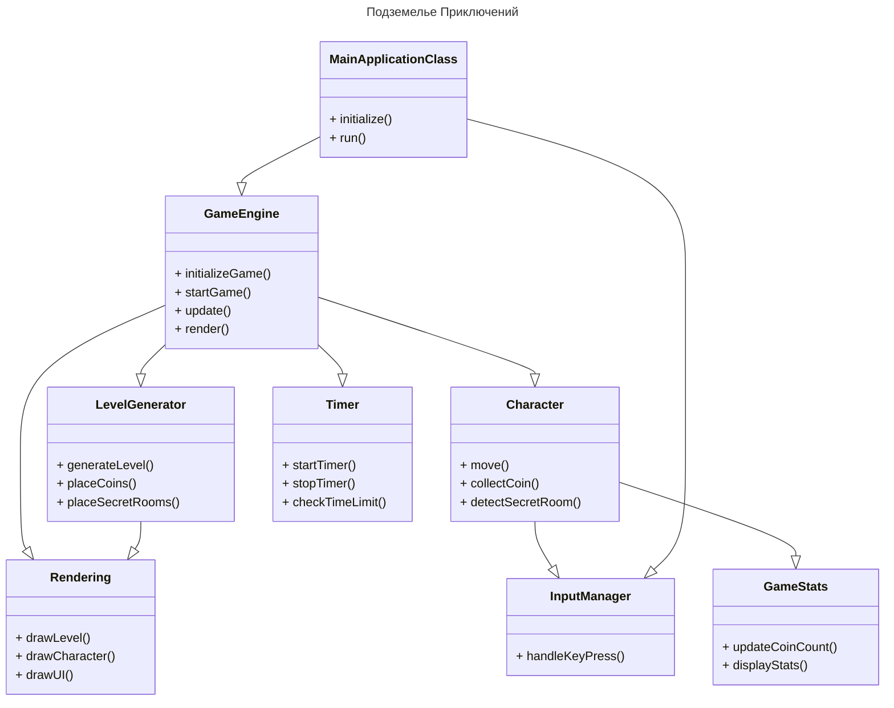

# Структурные модели
----------------------------------------

## Описание внутренней структуры приложения




## Описание классов и их взаимодействие между собой

### Инициализация и запуск приложения:

- `MainApplicationClass` инициализирует приложение и запускает его, вызывая методы `initialize()` и `run()`.
  - `initialize()`: Этот метод выполняет все необходимые действия для начала работы приложения, такие как настройка параметров и загрузка ресурсов.
  - `run()`: Метод запускает основной цикл игры, который обрабатывает ввод, обновляет состояние игры и отображает графику.
- `MainApplicationClass` взаимодействует с `GameEngine`, передавая ему управление для начала и обновления игры.

### Управление игровым процессом:

- `GameEngine` управляет основным игровым процессом, инициализируя, запуская и обновляя игру.
  - `initializeGame()`: Инициализирует игру, подготавливая все необходимые компоненты и начальные условия.
  - `startGame()`: Запускает игровой процесс, начиная основной игровой цикл.
  - `update()`: Метод обновляет состояние игры на каждом кадре, обрабатывая все действия персонажа, врагов и других элементов.
  - `render()`: Отображает текущее состояние игры на экране.
- `GameEngine` взаимодействует с `LevelGenerator`, чтобы сгенерировать уровень, разместить на нём монеты и секретные комнаты.
- `GameEngine` обновляет состояние персонажа через взаимодействие с `Character` и проверяет время игры с помощью `Timer`.

### Взаимодействие с пользователем:

- `Character` взаимодействует с `InputManager`, чтобы обрабатывать пользовательский ввод, в частности, управление движением персонажа.
  - `move()`: Обрабатывает ввод пользователя для перемещения персонажа по игровому уровню.
  - `collectCoin()`: Метод, вызываемый при сборе монеты персонажем.
  - `detectSecretRoom()`: Проверяет, обнаружил ли персонаж секретную комнату.
- `InputManager` передаёт информацию о нажатых клавишах персонажу для обновления его состояния.

### Отображение игрового процесса:

- `Rendering` отвечает за отображение игрового уровня, персонажа и интерфейса пользователя.
  - `drawLevel()`: Отображает игровой уровень на экране.
  - `drawCharacter()`: Отображает персонажа на экране.
  - `drawUI()`: Отображает интерфейс пользователя на экране, такой как количество монет или здоровье.
- `Rendering` взаимодействует с `LevelGenerator`, чтобы отобразить сгенерированный уровень, и с `Character`, чтобы отобразить персонажа.

### Отслеживание статистики игры:

- `Character` взаимодействует с `GameStats`, чтобы обновить количество собранных монет и отобразить статистику на экране.
  - `updateCoinCount()`: Обновляет количество собранных монет персонажем.
  - `displayStats()`: Отображает статистику игры, например, количество собранных монет и время игры.

```mermaid
objectDiagram
    gameStats : GameStats
    character : Character
    timer : Timer
    levelGenerator : LevelGenerator
    point : Point
    direction : Direction
    goodCoin : Coin
    badCoin : Coin
    coinType : CoinType

    gameStats <.. game : contains
    character <.. game : contains
    timer <.. game : contains
    levelGenerator <.. game : contains
    point <.. character : contains
    direction <.. character : contains
    goodCoin <.. character : contains
    badCoin <.. character : contains
    coinType <.. goodCoin : contains
    coinType <.. badCoin : contains

```