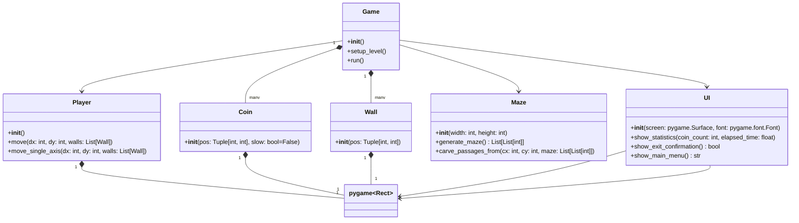

# Структурные модели
----------------------------------------

## Описание внутренней структуры приложения

## Описание классов и методов:

1. **Game**
   - `__init__()`: Создает экземпляры всех необходимых классов (Player, Maze, UI), инициализирует игровой экран, устанавливает начальные параметры игры.
   - `setup_level()`: Вызывает методы Maze для генерации лабиринта, создания стен, монет и установки стартовой и конечной точек. Устанавливает игрока на стартовую позицию.
   - `run()`: Основной игровой цикл, который обрабатывает пользовательский ввод, перемещает игрока, обновляет состояние игры (количество монет, время), проверяет условия победы и поражения, отображает интерфейс и элементы игры на экране. При необходимости вызывает методы UI для показа статистики и подтверждения выхода.

2. **Player**
   - `__init__()`: Создает прямоугольник игрока и задает начальную скорость.
   - `move(dx: int, dy: int, walls: List[Wall])`: Перемещает игрока на заданное расстояние по осям x и y, проверяя столкновения со стенами. Если игрок сталкивается со стеной, его позиция корректируется.
   - `move_single_axis(dx: int, dy: int, walls: List[Wall])`: Обрабатывает перемещение игрока по одной оси, проверяя столкновения со стенами.

3. **Coin**
   - `__init__(pos: Tuple[int, int], slow: bool=False)`: Создает монету на указанной позиции и указывает, замедляет ли она игрока.
   
4. **Wall**
   - `__init__(pos: Tuple[int, int])`: Создает стену на указанной позиции.

5. **Maze**
   - `__init__(width: int, height: int)`: Инициализирует лабиринт с заданными параметрами.
   - `generate_maze() -> List[List[int]]`: Генерирует лабиринт с использованием алгоритма DFS и возвращает его в виде двумерного списка.
   - `carve_passages_from(cx: int, cy: int, maze: List[List[int]])`: Рекурсивно создает проходы в лабиринте, начиная с указанных координат.

6. **UI**
   - `__init__(screen: pygame.Surface, font: pygame.font.Font)`: Инициализирует интерфейс, принимает экран и шрифт для отображения.
   - `show_statistics(coin_count: int, elapsed_time: float)`: Отображает статистику игры (количество собранных монет и прошедшее время) на экране.
   - `show_exit_confirmation() -> bool`: Показывает пользователю окно подтверждения выхода из игры и возвращает результат (выход или продолжение).
   - `show_main_menu() -> str`: Показывает главное меню и возвращает выбор пользователя (например, "start").

### Взаимодействие между классами:

Взаимодействие между классами осуществляется через вызов методов: 
- Game вызывает методы Player для перемещения игрока, Maze для генерации лабиринта, UI для отображения интерфейса.
- Player проверяет столкновения с элементами лабиринта (стены, монеты).
- UI показывает пользователю информацию о текущем состоянии игры и обрабатывает пользовательский ввод для подтверждения выхода или выбора в главном меню.
