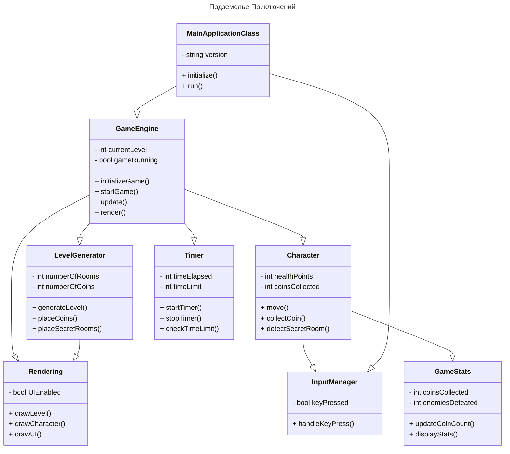

```mermaid
---
title: Подземелье Приключений
---

classDiagram 
    class GameEngine {
        + initializeGame()
        + startGame()
        + update()
        + render()
        - int currentLevel
        - bool gameRunning
    }
    class LevelGenerator {
        + generateLevel()
        + placeCoins()
        + placeSecretRooms()
        - int numberOfRooms
        - int numberOfCoins
    }
    class Character {
        + move()
        + collectCoin()
        + detectSecretRoom()
        - int healthPoints
        - int coinsCollected
    }
    class Timer {
        + startTimer()
        + stopTimer()
        + checkTimeLimit()
        - int timeElapsed
        - int timeLimit
    }
    class Rendering {
        + drawLevel()
        + drawCharacter()
        + drawUI()
        - bool UIEnabled
    }
    class InputManager {
        + handleKeyPress()
        - bool keyPressed
    }
    class GameStats {
        + updateCoinCount()
        + displayStats()
        - int coinsCollected
        - int enemiesDefeated
    }
    class MainApplicationClass {
        + initialize()
        + run()
        - string version
    }

    GameEngine --|> LevelGenerator
    GameEngine --|> Character
    GameEngine --|> Rendering
    GameEngine --|> Timer
    LevelGenerator --|> Rendering
    Character --|> InputManager
    Character --|> GameStats
    MainApplicationClass --|> GameEngine
    MainApplicationClass --|> InputManager
```