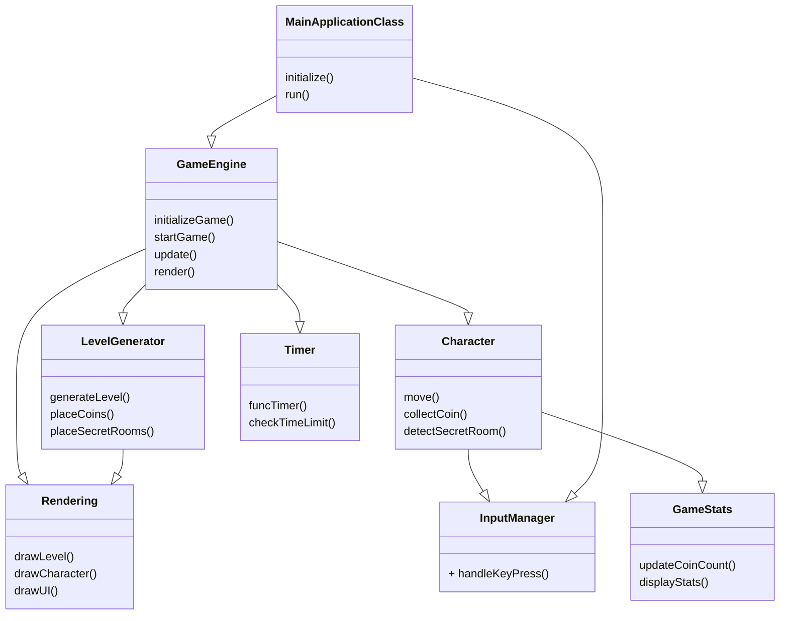
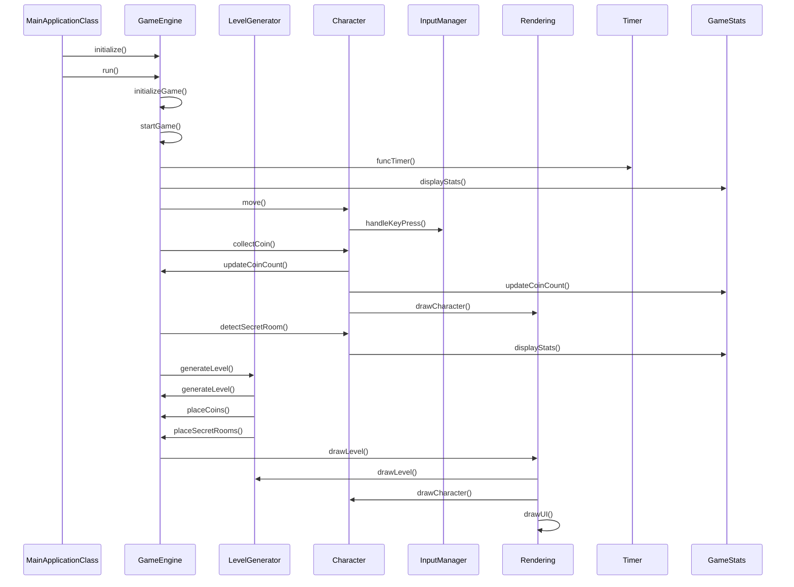

# Структурные модели
----------------------------------------

## Описание внутренней структуры приложения

## Описание классов и их взаимодействие между собой

### Инициализация и запуск приложения:

- `MainApplicationClass`
	`initialize()`: Этот метод выполняет все необходимые действия для начала работы приложения. Например, настройка параметров и загрузка ресурсов.
	`run()`: Метод запускает основной цикл игры, который обрабатывает ввод, обновляет состояние игры и отображает графику.

- `MainApplicationClass` взаимодействует с `GameEngine`, передавая ему управление для начала и обновления игры.

### Управление игровым процессом:

- `GameEngine` управляет основным игровым процессом, инициализируя, запуская и обновляя игру.
	`initializeGame()`: Инициализирует игру, подготавливая все необходимые компоненты и начальные условия.

	`startGame()`: 	Запускает игровой процесс
			Запускает таймер
			Обнуляет счетчик монет

	`update()`: Метод обновляет состояние игры на каждом кадре, обрабатывая все действия персонажа, врагов и других элементов.
	`render()`: Отображает текущее состояние игры на экране.

- `GameEngine` взаимодействует с `LevelGenerator`, чтобы сгенерировать уровень, разместить на нём монеты и секретные комнаты.
- `GameEngine` обновляет состояние персонажа через взаимодействие с `Character` и проверяет время игры с помощью `Timer`.

### Взаимодействие с пользователем:

- `Character` взаимодействует с `InputManager`, чтобы обрабатывать пользовательский ввод, в частности, управление движением персонажа.

  - `move()`: Обрабатывает ввод пользователя для перемещения персонажа по игровому уровню.
	`move()`: Персонаж может передвигаться вверх, вниз, вправо, влево.
		Перемещаться может строго в пределах видимости карты.
		Сквозь стены перемещаться персонаж не может. Если он ее встречает на своем пути, то он останавливается.
		У персонажа постоянная скорость, ускоряться он не может.

	`collectCoin()`: 	
			Размер ее будет чуть меньше персонажа
			Монетка никаких бустов персонажу не дает
			У монетки будет свой радиус действия, в котором пользователь может нажать на клавищу R и подобрать ее
			В случае, если пользователь не в радиусе действия монетки, он ее подобрать не может
			Внешний вид монетки так же придумаю в процессе разработки. Предположительно, она будет квадратная и желтая
			Выбрасывать монетки персонаж не может

	`detectSecretRoom()`: Проверяет, обнаружил ли персонаж секретную комнату

- `InputManager` передаёт информацию о нажатых клавишах персонажу для обновления его состояния.

### Отображение игрового процесса:

- `Rendering`
	`drawLevel()`: 	Отображает игровой уровень на экране.
			Всего будет 3 вида игровой карты

	`drawCharacter()`: 	Отображает персонажа на экране.
				Размер персонажа установлю в процессе разработки.
				Как будет выглядеть персонаж тоже придумаю в процессе разработки, подгоняя под параметры игрового поля.
				
	`drawUI()`: Отображает интерфейс пользователя на экране, такой как количество монет или здоровье.

- `Rendering` взаимодействует с `LevelGenerator`, чтобы отобразить сгенерированный уровень, и с `Character`, чтобы отобразить персонажа.

### Отслеживание статистики игры:

- `Character` взаимодействует с `GameStats`, чтобы обновить количество собранных монет и отобразить статистику на экране.
	
	`updateCoinCount()`: 	В случае выигрыша количество монеток отображается в статистике
			   	В случае проигрыша количество монеток отображается в статистике
				В случае проигрыша счетчик монет обнуляется при перезапуске игры
				Максимум их может быть собранно 20 штук
				Если счетчик монет равен 20 = персонаж выиграл.
				В случае, если персонаж ее подобрал, то в счетчик монет прибавляется +1 монетка

	`displayStats()`: Отображает статистику игры:
				Количество собранных монет
				Время игры

## Диаграмма обьектов 

Взаимодействие начинается с инициализации и запуска приложения, когда `MainApplicationClass` вызывает методы `initialize()` и `run()`. Затем `GameEngine` инициализирует и запускает игру, что включает в себя генерацию уровня (`LevelGenerator`), начало отсчёта времени (`Timer`), инициализацию статистики (`GameStats`) и обработку действий персонажа (`Character`).

Персонаж (`Character`) взаимодействует с менеджером ввода (`InputManager`), чтобы обрабатывать пользовательский ввод, а также с `GameStats` для обновления счетчика монет и отображения статистики. 

Генератор уровней (`LevelGenerator`) предоставляет информацию о созданном уровне `GameEngine`, который в свою очередь передает эту информацию `Rendering` для отображения уровня на экране, включая расположение монет и секретных комнат.

`Rendering` отвечает за отображение элементов игры на экране, включая персонажа, уровень и интерфейс пользователя. 

Время игры отслеживается через `Timer`, а статистика игры (например, количество собранных монет) обновляется и отображается с помощью `GameStats`.
