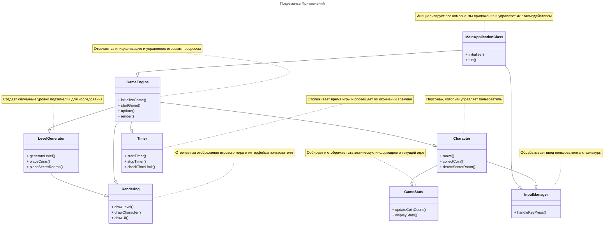

# Структурные модели
----------------------------------------

## Описание внутренней структуры приложения

```mermaid
---
title: Подземелье Приключений
---
classDiagram 
    class GameEngine {
        + initializeGame()
        + startGame()
        + update()
        + render()
    }
    class LevelGenerator {
        + generateLevel()
        + placeCoins()
        + placeSecretRooms()
    }
    class Character {
        + move()
        + collectCoin()
        + detectSecretRoom()
    }
    class Timer {
        + startTimer()
        + stopTimer()
        + checkTimeLimit()
    }
    class Rendering {
        + drawLevel()
        + drawCharacter()
        + drawUI()
    }
    class InputManager {
        + handleKeyPress()
    }
    class GameStats {
        + updateCoinCount()
        + displayStats()
    }
    class MainApplicationClass {
        + initialize()
        + run()
    }

    note for Character "Персонаж, которым управляет пользователь"
    note for LevelGenerator "Создает случайные уровни подземелий для исследования"
    note for GameEngine "Отвечает за инициализацию и управление игровым процессом"
    note for Timer "Отслеживает время игры и оповещает об окончании времени"
    note for Rendering "Отвечает за отображение игрового мира и интерфейса пользователя"
    note for InputManager "Обрабатывает ввод пользователя с клавиатуры"
    note for GameStats "Собирает и отображает статистическую информацию о текущей игре"
    note for MainApplicationClass "Инициализирует все компоненты приложения и управляет их взаимодействием"
    GameEngine --|> LevelGenerator
    GameEngine --|> Character
    GameEngine --|> Rendering
    GameEngine --|> Timer
    LevelGenerator --|> Rendering
    Character --|> InputManager
    Character --|> GameStats
    MainApplicationClass --|> GameEngine
    MainApplicationClass --|> InputManager

```
